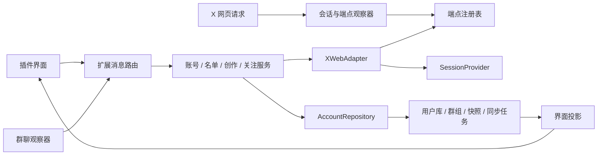

# CircleMate 底层架构

版本：0.5.0。数据版本：4。下文保留早期设计背景；现行差异见 [0.5.0 修复记录](release-v0.5.0.md)。

当前后台由优先级串行调度器统一执行，用户写意图持久化到账号队列；自动读取每轮让出执行权。运行中写任务重启后先读取关系核验，不重放 POST。关系投影复用本地索引，以名单扫描开始时间和直接证据时间解决冲突。成员数据分桶存储，界面投影按账号隔离并以修订号防止旧响应倒退。异常记录归属于账号缓存，不依赖群列表生命周期。

autoSync 的运行状态只在实际请求时提交，并记录 currentKind 与两分钟 activeUntil；不请求的缓存检查不显示运行中。分页间歇为 waiting，出错为 partial。界面用运行租期驱动绿点闪烁，正常分页隐藏手动续传，失败保留重试入口与退避时间。

后台 auto-sync.js 管理持久化缓存有效期与各任务退避。SESSION_READY、GET_STATE、关注成功和每分钟 alarms 检查触发串行同步；同一标签页请求去重。账号资料 15 分钟、分析 1 小时、名单 6 小时。名单每轮各一页，游标由现有服务逐页提交。GET_STATE 在网络队列外返回账号缓存，避免分页阻塞弹窗；storage.onChanged 将后续结果送到界面。无已登录 X 标签页时停止请求。

GET_STATE 还会向顶层 content script 请求当前原生页面快照，仅接受登录用户自己的资料或关系列表页。shared/native-page.js 读取精确数量和已加载 UserCell 的关系状态；不请求接口，不把昵称当数字 ID，不标记名单完整。已知成员可复用原生关系观察，已确认关注写入不被旧页面状态覆盖。弹窗账号卡展示数量来源，“数据”标签展示原生行。

## 数据流

## 模块与职责

| 模块 | 职责 | 后续扩展方式 |
| --- | --- | --- |
| s群ession.js | 识别标签页 Cookie store、登录账号、CSRF；内存授权头；检测账号切换 | 增加其他授权来源，不改业务服务 |
| endpoint-registry.js | 观察白名单 GraphQL GET 请求，记录 queryId、参数名称、布尔开关与 HTTP 状态 | 核验新操作后加入白名单 |
| x-adapter.js | X 请求、错误转换、返回结构解析；动态 GraphQL 与实验版旧接口 | 每种新数据源实现独立方法和结构测试 |
| domain.js | 用户 ID 合并、字段来源、名单快照、群关系补全、界面投影 | 增加领域实体，避免 UI 自行解释原始响应 |
| repository.js | 账号隔离、本地保存、旧数据迁移 | 保留 load/save 合同，可换成 IndexedDB |
| services.js | 用例、分页任务、关注确认、每日分类统计 | 通过 createServices 注入适配器和 checkpoint |
| service-worker.js | 装配、消息权限、请求串行化、会话复核 | 不在入口堆放功能逻辑 |
| content | 在嵌入框架观察明确成员行，只传用户名引用 | 适配新的成员列表 DOM 或已核验参与者接口 |
| popup | 呈现已处理数据，提交单次用户动作 | 新视图通过消息调用服务 |

## 账号库

本地键：`circlemate_account_v3_<accountId>`。`circlemate_local_v1` 只作为当前账号界面投影，兼容现有弹窗订阅；后台不把它当数据库真源。

每个账号包含：

- `users[id]`：昵称、用户名、简介、关注关系、蓝V、认证类型。按稳定 ID 去重，用户名可以变。
- `fieldSources[field]`：字段来源和观察时间；缺失字段不覆盖已知字段。旧 verified 不代替 is_blue_verified。
- `groups[groupId]`：成员 ID 引用、标题、观察时间、完整性。来源为成员行 DOM 引用；usernames 与 userIds 分开，failedReferences 保存失败资料。不能声称群名单完整。
- `lists[kind]`：完整名单、时间、有效性、上一完整基线与变化。
- `tasks[kind]`：暂存 ID、游标、页数、适配器、状态、错误、重试时间。
- `account`：账号总量及读取时间。
- `creator`：分页样本中的今日原创、回复、转帖和日期口径；tasks.creator 保存各类游标与当天分类记录，不保存正文。
- `contacts`、`dailyPlan`：为标签备注与目标设置保留的数据边界。目标界面已实现，0 至 1000 的整数；联系人界面尚未实现。

新账号不会覆盖其他账号的库。只迁移拥有明确匹配 accountId 的 v2 群记录；没有账号归属的旧记录不复用。v2 名单不迁移成完整快照，以免建立错误基线。

当前使用 Chrome 本地存储，没有 unlimitedStorage 权限。大规模名单或长期帖子归档应迁入 IndexedDB；不可直接把无限响应或完整帖子写入当前库。

## 同步状态机

`pending → running → paused / complete / error`

一次界面操作读取一页。每页成功后提交游标和数据。关闭弹窗、后台休眠或遇到错误后，下一次“续传”从已提交页开始。读取失败不把游标推进；游标没有前进时停止。429 保存重试时间，冷却期间不请求。没有自动循环、后台定时抓取或写入重试。

适配器在同一次任务中固定为 legacy 或 graphql，防止用一种接口的游标调用另一种接口。“重建名单”创建新任务，从第一页开始；旧完整快照保留到新任务完成。进行中的暂存名单不覆盖完整基线。

## 数据口径

关注数减粉丝数是数量差。未回关人数必须有双方完整且有效的名单。名单中的存在关系可以补全；未完整名单中的缺席不能推出“未关注”。一次关注写入后把关注快照标为过期，并清空需要重读的关注总数。

首次完整同步建立基线。后续完整同步才计算 added/removed。同步中的缺席不计作取消关注；变化反映两个时间点的名单差异，不保证中途每个事件都被记录。

GraphQL 只在识别明确 Bottom 结束指令时提交完整快照；缺失结构或结束信号显示错误，需按真实响应补充解析。旧接口以 next_cursor_str 为 0 作为结束信号。

今日创作按 Asia/Shanghai 计算，通过实际核验的 UserOriginalsTimeline、UserRepliesTimeline、UserRepostsTimeline 各读一页。按作者 ID 过滤回复父帖，按帖子 ID 去重；无效时间不计入今日。coverage 保存每类分页状态，单页数量不表示完整全天。续传逐页提交，达到三类时间线结束才显示完整覆盖。累计 tweet_counts.tweets 不代表原创总数。

## 消息合同

请求字段：action、tabId；列表另带 kind、restart；关注另带 groupId、userId。

| action | 来源 | 用途 |
| --- | --- | --- |
| GET_STATE | 扩展弹窗 | 读取当前标签页登录账号库，不要求捕获授权头 |
| ACCOUNT | 扩展弹窗 | 更新账号总量 |
| SYNC_LIST | 扩展弹窗 | following / followers / verifiedFollowers 单页同步或续传 |
| RELATIONSHIPS | 扩展弹窗 | 兼容动作，分别同步关注和粉丝一页 |
| CREATOR | 扩展弹窗 | 更新近期创作样本 |
| FOLLOW | 扩展弹窗 | 提交当前群内成员的一次关注 |
| ROSTER | 本扩展内容脚本 | 提交观察到的群成员字段 |
| ENDPOINTS | 扩展弹窗 | 导出脱敏端点诊断，不请求 X 数据 |

返回：ok、state；失败带 error、code、retryAt。会话仍相同时返回已提交进度，支持续传。账号切换时不把旧账号进度返回当前界面。

发送方须为本扩展。内容脚本只允许 FRAME_CONTEXT、ROSTER_REFERENCES 与兼容 ROSTER，不能调用关注写入。后台通过 chrome.tabs.get 核对当前群 ID；成员引用仅接受群信息页。FOLLOW 必须命中账号库的当前群成员，拒绝自关注及重复已确认请求；响应确认 following 或 follow_request_sent 后才改本地状态。

## 凭据与观察边界

Cookie 由 Chrome 会话管理。观察到的授权头按标签页留在内存，关闭标签页清除；未捕获时使用公开网页应用令牌。账号请求优先用当前页面用户名和 UserByScreenName，结果 ID 必须与 Cookie 一致。扩展不持久化个人凭据或原始请求 URL。隐身模式暂不支持，避免扩展请求与隐身 Cookie store 混用。

适配器优先将白名单请求发往当前 X 标签页的顶层 content script，由页面会话执行 fetch；无页面处理器时才使用后台传输。处理器校验扩展来源、目标路径与当前账号，前后检查 Cookie 会话；后台仍保留前后会话校验。POST 响应丢失或执行异常时不自动切换传输或重发。GraphQL GET 遇到过期观察配置的 400/404，可回退到不同查询 ID 的内置配置，成功后移除旧配置。

端点注册表只保存白名单 GET 操作名、查询 ID、变量名称、布尔变量默认值、count、布尔功能开关、观察时间和 HTTP 状态。HTTP 200 不等于响应结构已验证。导出文件不含用户 ID 值、游标值、Cookie 或请求头。

内容脚本使用 all_frames 与 match_origin_as_fallback 在相关嵌入框架运行。成员来源是带 aria-label 成员菜单和同级个人资料链接的行，顶层 fetch 拦截器已移除。FRAME_CONTEXT 由后台提供当前标签页群 ID，不从 about:blank 地址推断。ROSTER_REFERENCES 建立引用，ENRICH_GROUP 每次补全最多 10 人并逐人 checkpoint，失败成员分开重试。DOM 引用保留部分采集标记，仍不能证明完整性或成员已离群。

## 增加新能力

1. 在真实页面触发对应读取，记录脱敏请求和结构证据。
2. 在端点文档标明页面、方法、参数、分页、字段、验证时间。
3. 适配器实现返回标准实体，不把原始响应交给 UI。
4. 在领域层定义数据口径和完整性；在服务层增加 action。
5. 只持久化需要的实体；写入动作必须有独立用户触发。
6. 增加结构变化、分页、账号切换或写入失败测试，再接界面。

## 已验证检查

npm test：26 项通过，覆盖用户合并、迁移、账号隔离、后台消息路由、分页续传、失败游标、完整快照比较、关注成功失败、私密请求、端点脱敏、GraphQL 解析和会话切换。

这些是本地模拟检查，不代表真实 X 端点可用。真实页面与请求核验见 x-endpoints.md。

## 0.3.0 新增合同

| action | 来源 | 用途 |
| --- | --- | --- |
| FRAME_CONTEXT | 内容脚本 | 获取经顶层标签页 URL 校验的群上下文，不返回凭据 |
| ROSTER_REFERENCES | 内容脚本 | 成员用户名引用，不等同于完整用户资料 |
| ENRICH_GROUP | 弹窗 | 当前群每批最多 10 个资料请求；retryFailed 清理失败标记后重试 |
| ANALYTICS | 弹窗 | 近 7 个 UTC 日期分析，独立 state.analytics |
| DAILY_PLAN | 弹窗 | 校验并保存 posts / replies 目标，无网络写入 |

分析适配器生成匹配的毫秒与 ISO 时间窗口，汇总已核验 true/false 分区，不叠加 hourly_backfill。未知指标不补零；UTC 日桶不改标成北京时间。发生结构变化时保留上一成功分析数据。

嵌入框架配置依据：[Chrome content scripts 文档](https://developer.chrome.com/docs/extensions/develop/concepts/content-scripts#inject-in-related-frames)。实际 DOM 已核验；安装后联调仍需重载插件，当前工具的 URL 策略阻止进入扩展管理页。

## 0.3.1：内置配置与更新

bundled-endpoints.js 保存 2026-10-04 浏览器原生请求的公共配置，8 个操作均观察到 HTTP 200。EndpointRegistry 从内置副本启动；load 按 observedAt 合并缓存，较旧缓存不遮挡新的内置版本。较新观察保留优先级，兼容旧记录缺少 defaults 的情况。

首次使用无需逐个打开功能页面。会话 Cookie、CSRF 与授权头仍来自当前标签页；内置配置不含账号 ID、游标或凭据。没有时间到期后强制用户重访页面的规则；接口 400/404 才提示对应页面刷新配置。

本次 29 项本地测试通过。原生端点返回 200 与安装后扩展请求联调分别记录，不把前者当作后者。
